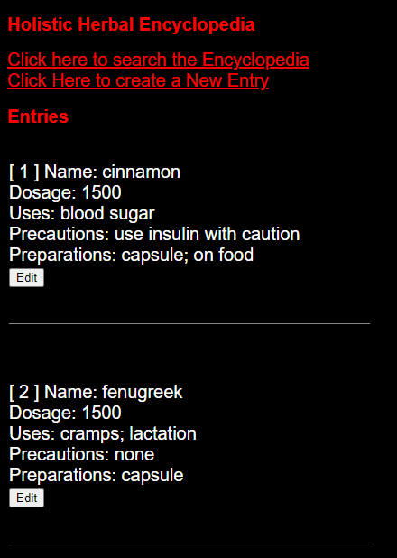
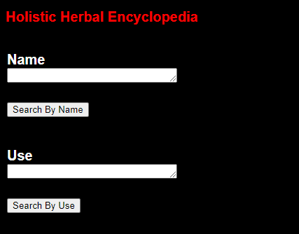
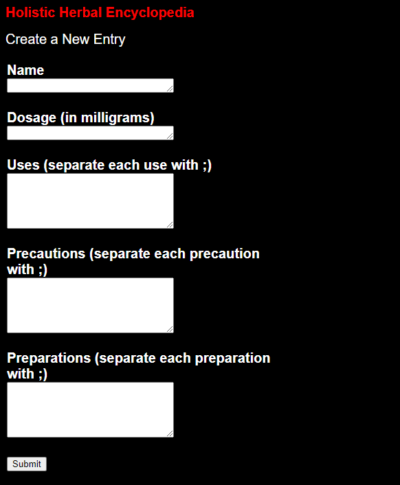

# Holistic Herbal Encyclopedia

The Holistic Herbal Encyclopedia is a web application designed to provide information on various herbs, their uses, dosage, precautions, and preparations. It serves as a valuable resource for individuals interested in herbal remedies, holistic health practices, and alternative medicine.

# Features

- Herb Information: Browse through a collection of herbs with detailed information including name, dosage, uses, precautions, and preparations.
- Search Functionality: Easily search for herbs based on their names or specific uses.
- Edit Entries: Ability to edit existing entries to ensure accuracy and relevance or to add new information as it becomes available.

# Getting Started
## Prerequisites
- Go programming language installed
- SQLite database

## Installation
1. Clone the respository  
`git clone https://github.com/your_username/holistic-herbal-encyclopedia.git`  
`cd holistic-herbal-encyclopedia`

2. Install dependencies  
`go mod tidy`  

3. Run the application  
`go run main.go`  

4. Access the application in your web browser at:  
`http://localhost:8080`  

# UI
## Home Page

## Search Page

## New Entry Page
